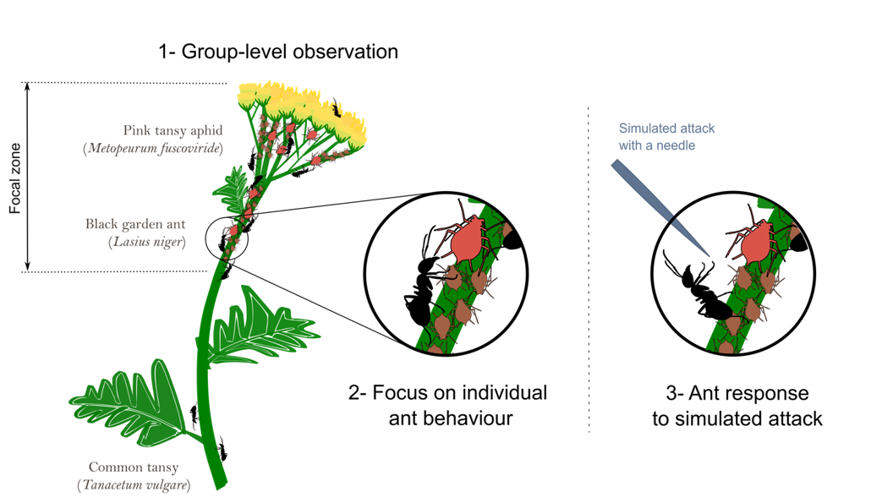

# Assessing changes in an ant-aphid mutualism across urban grasslands 
This repository contains the data and R code to analyse changes in aphid and ant populations and behaviour along a gradient of urbanisation in Berlin, Germany. 
This is a work in progress associated to a publication in preparation.

## Abstract
Urbanisation challenges species to cope with novel environmental conditions, which may result in the disruption of mutualistic interactions. While some mutualisms, like pollination, have been shown to be at risk in cities, little is known about how other types of mutualisms are affected by urbanisation. We studied the protective mutualism between the pink tansy aphid (*Metopeurum fuscoviride*) and the black garden ant (*Lasius niger*) along an urbanisation gradient in Berlin, Germany. Repeated observations in nine locations along this gradient allowed us to quantify the investment of ants in tending aphids, the survival and growth of tended aphid colonies, and the behavioural response of ants to a simulated attack on the aphids. Aphid colonies flourished and were tended equally across the urbanisation gradient, and there was a consistent positive relationship between aphid and ant numbers. However, ants defended aphids more aggressively in more urban environments. Our study suggests that not only this protective mutualism is maintained in the city, but that ants might even rely more on it and thus defend it more aggressively. Such behavioural changes may explain in part the success of these mutualistic ants as food resources become scarce and unpredictable with urbanisation, and highlights the importance of protective mutualisms for urban biodiversity. 

## Authors
Hannah Gaber, Maud Bernard-Verdier, Florian Ruland and Jonathan Jeschke

## Licence
All R code is under the MIT license.
All data files are available for reuse only with permission from the authors.

## Data collection

We conducted a field survey in August 2018 to investigate how the mutualism between the black garden and (*Lasius niger*) and the pink tansy aphid (*Metopeurum fuscoviride*) on tansy host plants (*Tanacetum vulgare*) changes in response to urbanisation. For this purpose, we designed a field experiment to collect data on aphid numbers, number of attending ants and mutualistic ant behaviour. Data collection was replicated along an urbanisation gradient in Berlin and repeated 4-7 times at each study site. The data collection at a particular study site on a particular date was determined by the study of one ant-aphid-host plant system (i.e. sampling session): We started by locating the plant area with the main aphid cluster (henceforth called the **“focal zone"**), measured its length and counted all live aphids and mummies (parasitized aphids) within this focal zone. Then, ant behaviour was observed undisturbed, at the **(1)** group level (i.e. we counted the number of ants in the focal zone and recorded changes in ant number during 1 min; this was replicated five times per sampling session). Secondly, we recorded ant behaviour at **(2)** individual level via focus behaviour observations of 2-5 focal ants during 1-5 minutes each. In a third phase, we **(3)** recorded behavioural responses of individual ants targeted by a simulated attack using a needle. 

## Data files
The raw data of this study is stored in form of *.csv*-files  that are located in the folder [data](data). A description of the data tables is given in the excel file [DESCRIPTION.xlsx](data/DESCRIPTION.xlsx) - this file contains ten sheets which provide the definitions of rows and columns of the raw data tables; each sheet is named according to the *csv*-file that it describes.
> In the following sections we refer to specific columns of the data tables using '$*columnname*'.
- [GivenMeta_plots.csv](data/GivenMeta_plots.csv): metadata of 56 dry grassland sites located in Berlin, Germany, which form a research platform to investigate urban ecosystem functioning (see [CityScapeLab Berlin](https://www.mdpi.com/2071-1050/12/6/2565) for more details). We selected nine of these sites to conduct our study which were located along a gradient of urbanisation. The percentage of sealed surfaces in a 500m buffer around the study site ($Seal_500) was used as explanatory variable to describe the gradient of urbanisation.
- [General_plot.csv](data/General_plot.csv): metadata of the nine study sites selected for the field survey, i.e. the plot ID ($plot), the geographical coordinates ($Long, $Lat), the number of visits of the site ($visits), the number of sampling sessions that were undertaken ($sample size) and the number of studied ant-aphid-host plant systems ($N_plant)
- [Met_plot_date.csv](data/Met_plot_date.csv): study site metadata collected during each sampling session (i.e. the study of a particular ant-aphid-host plant system at a particular date). We measured the temperature before, during and after each sampling session ($temp1, $temp2 and $temp3) to control for temperature effects on ant behaviour. We additionally collected supporting information on weather, presence of other ant species on the host plant and presence of aphid predators to describe the ecological context of our data.
- [Met_plant.csv](data/Met_plant.csv): host plant metadata collected during each sampling session. It includes supporting information on host plant phenology ($stade1: budding, $stade2: full flowering, $stade3: end of flowering, $stade4: desiccated plant), location of the aphid colony (i.e. stalk/leaves/flower) and organisation of the aphid colony (i.e. aggregated/dispersed). We further counted the number of parasitized aphids (i.e. mummies) within the aphid colony and calculated the proportion of parasitized aphids ($prop_paras, i.e. the number of parasitized aphids relative to the total number of aphids) to test how parasitism influenced the survival/extinction of aphid colonies. 
- [aphid_extinctions.csv](data/aphid_extinctions.csv): We recorded at each visit of the study site whether previously studied ant-aphid-host plant systems survived or went extinct. The file lists the systems which went extinct during the field survey and the date of record. This information was used to test how parasitism influenced the survival/extinction of aphid colonies.
- [Exp1.csv](data/Exp1.csv): focal ant metadata. We recorded during each sampling session the behaviour of 2-5 focal ants during 1-5 minutes each using a voice recorder. The file contains supporting information about the focal ants, essentially in which plant area the focal ant was situated during the focus observation. This information was used to discriminate between "caretakers" (ant stays in the area of the aphid colony, i.e. in the focal zone), "scouts" (ant moves away from the aphids to explore other plant parts) and "transporters" (ant leaves the host plant). Each record of focal ant behaviour (stored in [activity_sequence.csv](data/activity_sequence.csv)) has a unique identifier ($rec) that links the record to the focal ant metadata. 
- [activity_sequence.csv](data/activity_sequence.csv): data of focal ant behaviour (i.e. individual level observations). This file contains the records of ant behaviour collected during focus observations of 2-5 focal ants per sampling session. The focal ant was observed during 1-5 minutes and in situ behaviour was recorded based on predefined behavioural categories using a voice recorder. These predefined behavioural categories include palpating aphids with antennae and collecting their honeydew ("cl"), walking ("w" and "wf"), standing ("st" and "stf"), interacting with ants by antennae contact ("a"), trophallaxis ("k"), stretching the abdomen ("str"), grooming itself ("li") and possible other, undefined behaviours ("ow"). Voice records were subsequently re-written into text files which describe what the focal ant was doing during the record (i.e. a sequence of successive behaviours; behaviours are specified using the abovementioned code and separated by "-"; text items in brackets indicate the time duration in seconds of the behaviour.) These sequences of ant behaviours were used to calculate the total time, as proportions of total record length, the ant had allocated into the abovementioned behaviours. Each behavioural sequence has a unique identifier which links the behaviour data to the metadata of the focal ant.
- [Exp2.csv](data/Exp2.csv): data of group level observations collected during each sampling session. This file includes the measurements of the vertical length of the focal zone ($l, in mm) and counts of aphids in the focal zone ($N_aphid). These information were used to calculate an estimate of aphid density, i.e. the number of aphids per mm focal zone length. Furthermore, we estimated the number of ants in the focal zone ($t0 untill $t11). To account for the mobility of ants we recorded every five seconds during one minute the number of ants in the focal zone, resulting in 12 counts per minute. This measurement was replicated 5 times across the sampling session and used to derive the average number of ants tending the aphids.
- [Exp3a.csv](data/Exp3a.csv): data of group level observations after a simulated attack on the aphid colony using a needle. We simulated a predator attack on the aphids by pointing a fine needle in the center of the aphid colony and observed ant reactions: We counted the number of ants entering/leaving the focal zone, the number of ants reacting with hyperactivity, the number of ants showing no visble change in behaviour and the number of ants attacking the needle. This experiment was replicated three to four times per sampling session. The data of this experiment is not reported in our manuscript.
- [Exp3b.csv](data/Exp3b.csv): data of ant responses to a simulated attack. The attack was simulated by closely (i.e. few mm distanced) pointing a fine needle on the focal ant. We recorded how the ant reacted using a score of aggressiveness ("aggr"; 1= avoidance and running away, 2= tolerance, 3= curiosity and exploring the needle, 4= avoidance and aggressive posture, 5-7= aggressiveness and attacking the needle). We further recorded the context in which the focal ant had been disturbed ($t-1_w: walking; $t-1_st: standing, being inactive; $t-1_a: tending aphids). This experiment was replicated for 2-10 focal ants per sampling session. We used this data to estimate the number of avoiding ants vs. the number of aggressively responding ants per sampling session.
- [geodata](data/geodata): this folder contains shapefile data of Berlin used to create a map of the study sites.

## How to run the code
The R code used to analyse the data of this study and to produce the figures is located in the folder [scripts](scripts).  
The script [master.R](scripts/master.R) includes the entire code to reproduce the statistics and figures of the manuscript: **(1)** loads the required packages; **(2)** imports the raw data; **(3)** formats the raw data and derives the response and explanatory variables; **(4)** analyses the relationships between response variables and explanatory variables using linear mixed effect models (LMMs) and generalised linear mixed effect models (GLMMs), and performs diagnostical and statistical tests; **(5)** produces the figures of the manuscript.
> IMPORTANT: to run this code, first install the required packages using the command `install.packages("packagename")` and change the working directory `working_dir <- "C:/Hannah/Bachelorarbeit/BA Publication/Re-analysis-AphidAntMutualism-Berlin"` to the one where you stored the scripts and data folders.

**Running the code step by step**
> To avoid error messages, first load the packages mentioned in [master.R](scripts/master.R) and run the scripts in the below mentioned order. 

**I-Import the data** 
- run [import_data.R](scripts/import_data.R) to upload the *.csv*-files of the raw data in form of data frames into your R environment.

**II-Format the data** 
> In the following sections we refer to specific columns of data frames using '$*columnname*'.
- run [transform_General_plot.R](scripts/transform_General_plot.R) to get a summary table of the field survey including the ID of the study site ($plot.simple), the geographic location of the study sites ($Long, $Lat), the number of visits per study site ($N_visits), the number of sampling sessions per study site ($N_sampled) and the number of studied ant-aphid-host plant systems per study site ($N_plant). This summary table of the field survey can be alternatively found in the folder [results](results) in the file [field_summary.csv](results/field_summary.csv).
- run [transform_Met_plot_date.R](transform_Met_plot_date.R) to obtain the average temperature per sampling session ($mean.temp), calculated based on three temperature measurements per sampling session.
- run [transform_Met_plant.R](scripts/transform_Met_plant.R) to obtain the proportion of parasitized aphids (relative to the total number of counted aphids) per sampling session ($Prop_paras).
- run [transform_Exp1.R](scripts/transform_Exp1.R) to obtain the proportion of time (relative to the total record duration) that focal ants allocated in different behaviours. This script first classifies focal ants into caretakers/scouts/transporters according to the plant area where the ant was situated during the focus observation. Next, it processes the behavioural sequences of the focal ants (`source("scripts/import activity sequence.R")` - *line 44 of the code*) to derive the total time that each focal ant had allocated into different behaviours. Finally, it calculates the average proportion of time per sampling session that caretakers, scouts and transporters had allocated into tending aphids ($aphid_IA.sum), interacting with other ants ($ant_IA.sum), walking ($move.sum), being inactive ($stand.sum) and doing some other tasks ($other.sum) - these information are included in the data frame *activ_sum*. We considered the average time spent by caretakers into tending aphids (i.e. tending time) as response variable to analyse the effort investment of ants into aphid care. 
- run [transform_Exp2.R](scripts/transform_Exp2.R) to obtain the aphid density (i.e. number of aphids per mm of focal zone length; $N_aphid.mm) and the average number of ants (i.e. the mean number of ants in the focal zone averaged over 5 replicate records of one minute of the ant numbers in the focal zone; $meanAnt.mean) per sampling session. Furthermore, the script calculates an estimate of average ant attendance per sampling session ($AntperAphid.mean) that is the ratio of the average ant number over the aphid number.
- run [transform_Exp3a.R](scripts/transform_Exp3a.R) to quantitatively estimate the group level reaction of ants to a simulated attack on the aphid colony. We replicated the attack simulation three to four times and selected the replica which triggered the most aggressive reaction by ants: therefrom we derived the number of ants responding with a change in behaviour to the simulated attack (i.e. hyperactivity+attacks of the needle; $MAXREACT) and the number of aggressively reacting ants (i.e attacking the needle by jumps and bites; $MAXATTACK). (This data was not further analysed.)
- run [transform_Exp3b.R](scripts/transform_Exp3b.R) to obtain an estimate per sampling session of individual ant responses to a simulated attack. We tested ant responses to a simulated attack on 2-10 focal ants per sampling session. This script first classifies focal ants according to what the ant was doing prior the simulated attack ($context: tending aphids vs. other behaviour). It then categorizes the focal ant's reaction into a response with 3 outcomes ($aggr_score) based on the focal ant's aggressivity score: avoidance (score 1 and 4) vs. aggressive reaction - biting (score 5-7 and $JUMP=0) vs. aggressive reaction - jumping (score 5-7 and $JUMP=1). (Note that in this step, observations of ants reacting with tolerance (score 2) and curiosity (score 3) were excluded from the analysis - it resulted in 47 excluded observations.)
- run [myResponseVariables.R](scripts/myResponseVariables.R) to produce a separate data frame for each response variable that includes the explanatory variables used to model the response. The set of response variables analysed with mixed effect models in this study consists of (1) the **aphid density** ($N_aphid.mm in the data frame *Aphid_density*), (2) the average number of ants, i.e. **ant number** and (3) the **ant-per-aphid ratio** ($meanAnt.mean and $AntperAphid.mean, respectively, in the data frame *Ant_attendance*), (3) the proportion of time spent by caretakers into tending aphids, i.e. **tending time** ($aphid_IA.sum in the data frame *Tending_Time*) and (4) the individual ant response to a simulated attack, i.e. **ant aggressivity** ($reaction in the data frame *Ant_aggressivity*). The set of explanatory variables consists of the percentage of sealed surfaces in a 500m buffer around the study site, i.e. sealing ($Seal_500), the sampling date ($date), the aphid number ($N_aphid), the mean ant number per sampling session ($meanAnt.mean), the mean temperature per sampling session ($mean.temp) and the plant phenology ($plantStade). The autocorrelation between explanatory variables can be checked by running the command `ggpairs(expVar[,c("date","mean.temp","N_aphid","meanAnt.mean","Seal_500","plantStade")])`- *line 21 of the code*. This diagnostical check revealed autocorrelations and resulted in the exclusion of mean temperature and plant phenology from the set of explanatory variables. Continuous explanatory variables were then standardized (mean of 0; standard deviation of 1) by running the command `expVar=mutate_at(expVar, vars(date,meanAnt.mean,N_aphid,prop_paras,mean.temp,Seal_500), funs(s = as.numeric( scale(.) ) ) )` - *line 29 of the code*.

**III-Analyse the data** 
 
The script [models_main.R](scripts/models_main.R) includes the code that was run to obtain the statistics reported in this study. The analysis of each response variable was performed in the same manner:
1. Check for normal distribution of the response (only necessary for continuous response variables) by plotting the response in form of a histogram - `hist(ResponseVariable)`. If necessary, transform the response to achieve normal distribution (we square root-transformed aphid density and log-transformed the ant number and the ant-per-aphid ratio).
2. Fit the model. 
To model **aphid density** we fit a LMM from the package *lmer* considering date (date_s), ant number (meanAnt.mean_s), sealing (Seal_500_s) and all two-way interactions as fixed effects, and used host plant (1|plantPop) as random effect: 
`Aph<-lmer(sqrt(N_aphid.mm) ~ date_s + meanAnt.mean_s + Seal_500_s +` 
            `date_s:meanAnt.mean_s + date_s:Seal_500_s +` 
            `meanAnt.mean_s:Seal_500_s + (1|plantPop),` 
          `data=Aphid_density)` 
           
To model **ant number** we fit a LMM from the package *lmer* considering date (date_s), aphid number (N_aphid_s), sealing (Seal_500_s) and all two-way interactions as fixed effects, and used host plant (1|plantPop) as random effect: 
`Ant.nb<-lmer(log(meanAnt.mean)~date_s + N_aphid_s + Seal_500_s + ` 
               `date_s:N_aphid_s + date_s:Seal_500_s +` 
               `N_aphid_s:Seal_500_s + (1|plantPop),`  
               `data=Ant_attendance)` 
                
To model **ant-per-aphid ratio** we fit a LMM from the package *lmer* considering date (date_s), aphid number (N_aphid_s), sealing (Seal_500_s) and all two-way interactions as fixed effects, and used host plant (1|plantPop) as random effect: 
`AntAtt<-lmer(log(AntperAphid.mean) ~ date_s + N_aphid_s + Seal_500_s +`  
              `date_s:N_aphid_s + date_s:Seal_500_s +` 
               `N_aphid_s:Seal_500_s + (1|plantPop),` 
             `data=Ant_attendance)` 
              
To model **tending time** we fit a beta regression model from the package *glmmTMB* considering date (date_s), aphid number (N_aphid_s), sealing (Seal_500_s) and all two-way interactions as fixed effects, and used host plant (1|plantPop) as random effect:  
`Tend.betareg <- glmmTMB(aphid_IA.sum ~ date_s + N_aphid_s + Seal_500_s + ` 
                          `date_s:N_aphid_s + date_s:Seal_500_s +` 
                          `N_aphid_s:Seal_500_s + (1|plantPop),` 
                       `data= tmp, family=beta_family)` 
                         
To model **ant aggressivity** as a binary response (aggressive ant reaction vs. avoidance) we fit a binomial GLMM from the package *lmer* considering date (date_s), aphid number (N_aphid_s), sealing (Seal_500_s), the context of disturbance (context: tending aphids vs. other behaviour) and selected two-way interactions as fixed effects, and included date nested into host plant (1|plantPop/date) as random effect:  
`reaction.binom<-glmer(reaction ~ context + date_s + N_aphid_s + Seal_500_s + context:date_s +` 
                       `context:N_aphid_s + context:Seal_500_s + date_s:N_aphid_s + date_s:Seal_500_s +` 
                        `N_aphid_s:Seal_500_s + (1|plantPop/date),` 
                     ` family = binomial, data=Ant_aggressivity,` 
                     ` glmerControl(optimizer = "bobyqa", optCtrl = list(maxfun = 100000)))` 
                       
3. Apply a diagnostical test to check model residuals. We therefore applied the simulation-based diagnostic approach using functions of the package *DHARMa*: 
 `hist(residuals(model))`  
`res <- simulateResiduals(model)` 
`plot(res) #if there is something wrong with the model, this is indicated in the residual plot`
4. Test for significant relationships between response and explanatory variables by looking at the model summary with the command `summary(model)`. This is done with a t-test that uses Satterthwaite's method for LMMs and with a Wald test (z-test) for beta regression models and binomial GLMMs.
5. Compute the marginal (=describes the proportion of variance explained by the fixed factor(s) alone) and conditional Rsquared (=describes the proportion of variance explained by both the fixed and random factors) of the model using the command `r.squaredGLMM(model)` from the package *MuMIn*. 
> Note that this command does not work for beta regression models.
6. Compute partial Rsquared of the fixed effects using the command `r2beta(model, method="nsj")` for LMMs and the command `r2beta(model, method="sgv")` for GLMMs from the package *r2glmm*.
> Note that these commands do not work for beta regression models.

  - The results from modeling are summarized in the excel sheet [Tables.xlsx](results/Tables.xlsx) stored in the folder [results](results). The table lists the coefficients of the fixed effects for each model, jointly with the p-values of explanatory variables obtained from the t-test/Wald test and partial Rsquared values. Furthermore, the marginal and conditional Rsquared are reported in the table for each model.

  - Additionally, we performed chisquare-tests to explore how parasitism of the aphids affected the likelihood of survival vs. extinction of the aphid colony. These tests can be reproduced by running the script [parasitism.R](scripts/parasitism.R). We run three tests asking the questions: (1) Were aphid colonies with signs of parasitism more prone to extinction than unparasitized, healthy aphid colonies?; (2) Were parasitized aphid colonies from low-medium urbanized study sites (<20% of sealed surfaces in a 500m buffer) more prone to extinction than parasitized aphid colonies from medium-high urbanized study sites (>30% of sealed surfaces in a 500m buffer)?; (3) Did aphid colonies which displayed >=10% of parasitized aphids all went extinct? The script prepares the data in three data vectors (X1, X2 and X3) that contain the information for performing the chisquare-tests, one for each data vector. Outcomes from the chisquare-tests can be reproduced running the command `chisq.test(X)` with X being the data vector.
> Note that we excluded ant-aphid-host plant systems that were studied on the last visit of the study site from this analysis due to missing information about their survival/extinction.

**IV-Plotting the data** 
- The script [figures_main.R](scripts/figures_main.R) produces the figures which are reported in the manuscript (main text and supplementary material). We used plotting function from the package *ggplot2* and color palettes from the package *viridis*. The script formats the data for plotting, produces the figures and stores these figures as pdf files in the folder [figures](figures):
  - [ant_aphid_nb.pdf](figures/ant_aphid_nb.pdf): visualizes the positive correlation between aphid density and ant number across 3 periods of the field survey (start: 1.-11.08.2018; mid: 12.-21.08.2018; end: 22.08-1.09.2018). Aphids were counted within an area of the host plant (focal zone) to derive aphid densities (number of individuals/vertical length of the focal zone). Ant numbers are the average number of ants in the focal zone (in decimals, based on 5 counts within 1 min each where ant movement in and out of the zone was monitored). Shown in the plot are the real data and three linear regressions that illustrate the positive interaction between date and numbers of ants and aphids.
  - [ant_aggressivity_predicted.pdf](figures/ant_aggressivity_predicted.pdf): visualizes the proportion of ants showing aggressive reactions to a simulated attack along the urbanisation gradient. Dots represent partial residuals and lines correspond to the fit of the binomial GLMM. % sealing is the percentage of sealed surfaces in a 500m radius around the study sites. The % sealing variable was standardized to fit the model and back transformed to produce the figure.
  - [aphid_numbers.pdf](figures/aphid_numbers.pdf): visualizes the temporal trends in aphid colony size (i.e. total number of live aphids). Trend are represented for each individual aphid colony (different symbols) in each plot (one per panel). Each panel corresponds to a plot (i.e. site) along the urbanization gradient (ordered by row from top to bottom according to increasing percentage of sealed areas in a 500m radius, i.e. % sealing). Observations of zero aphids are represented when we observed the local extinction of a given colony (all aphids disappeared or mummified by parasitoids). When possible, multiple colonies were observed in each plot to provide replicates, or to replace extinct colonies.
  - [aphid_density3.pdf](figures/aphid_density3.pdf): visualizes the increase in aphid densities and ant numbers over the period of the field survey. Aphid densities represents counts of aphids in the focal zone and divided by the length of the focal zone, ant numbers are average counts per sampling session. Dots are colored according to the percentage of sealed surfaces in a 500m radius around the study sites (cf. % sealing). Both response variables were not directly related to urbanisation.
  - [tending_time.pdf](figures/tending_time.pdf): visualizes the temporal increase of the proportion of time allocated by ants in tending aphids. Proportions were derived from field focus observations of individual ants during 2-5 minutes. Dots represent the real data and the line shows the model fit of the beta regression model.
  - [ant_behaviour.pdf](figures/ant_behaviour.pdf): visualizes the behavioural time allocation of focal ants along the urbanization gradient. Behaviours were classified in five simplified classes based on field focus observations of individual ants during 1-5 minutes. Individual records were averaged across ant replicates per colonies, colonies per site, and date of observation (i.e. summed time spent by ants in a behaviour/summed time of behaviour record). The urbanization gradient is captured by the percentage of sealed areas in a 500m radius around the grassland patch. No clear overall trend in time allocation could be detected, except a marginal tendency towards decreased tending time in more urban areas.
  - [parasitism.pdf](figures/parasitism.pdf): visualizes the relationship between aphid colony extinctions, survivals and the maximum proportion of aphid mummies (i.e. visibly parasitized individuals) across 29 ant-aphid-host plant systems studied during the field survey. In total 12 colonies went extinct during the survey. Seven aphid colonies were studied for the first time on the last sampling day, hence no statement could be done about their temporal development (classified as ‘unknown outcome’). For one extinct colony (Nh-04 Alpha), data on aphid mummies was missing, and it was therefore excluded from the categorization. This conditional survival data shows that higher proportions of parasitism (>10% of individuals) were associated with more frequent colony extinction, supporting the hypothesis that parasitism is a main driver of colony extinction in these populations. 
- The script [create_map.R](scripts/create_map.R) produces the figure [StudySites.pdf](figures/StudySites.pdf) that visualizes the geographical locations of the study sites in a map. Study sites are located in Berlin, Germany (grey shadowed). We visited a total of 24 sites, 9 of which hosted the same ant-aphid-plant interaction (large coloured circles). The remaining sites were excluded from this study (small grey circles). The colour gradient corresponds to the percentage of sealed surfaces in a 500m radius around each study site (i.e. % sealing).
